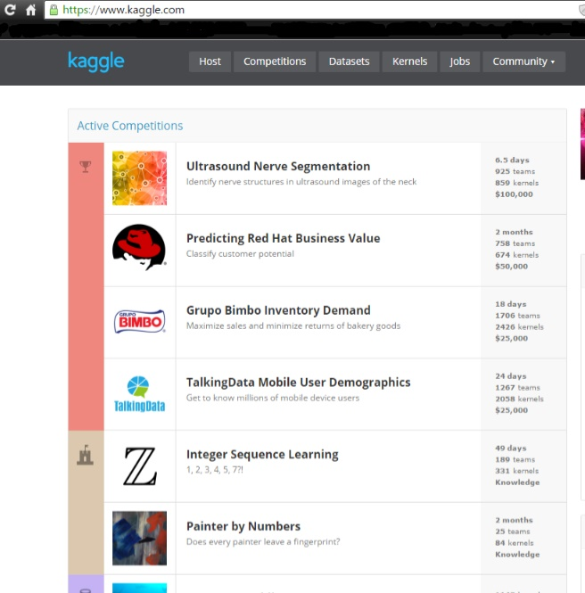

# Overview

This project downloads all datasets for a specified Kaggle competition in one line:

The command `./app.sh $COMP` will visit

## Run it as a docker container

`docker run -v $(pwd):/tmp/ efbbrown/kaggle-data-dl:0.2.4 ./app.sh $COMP`

# Pre-requisites

In order to run this command you will need:

- A kaggle account (assumed) 
- A cookies.txt file from kaggle.com
- The name of the kaggle compeition whose data you wish to download
- Docker installed on your computer

# Instructions by example

To demonstrate how to run this code I will use it to collect the data sets for the competition Predicting Red Hat Business Value.

</img>

## 1. The function accepts the competition name in lower case and with spaces replaced by hyphens.

'Predicting Red Hat Business Value' -> 'predicting-red-hat-business-value'

## 2. Create a new directory for your project and change into it. I usually use the name of the competition:

If you're working in a shell:

`~$ COMP=predicting-red-hat-business-value`
`~$ mkdir $COMP`
`~$ cd $COMP`

## 3. You need to save your cookies.txt file from the [Kaggle homepage](https://www.kaggle.com/).

In Chrome:

The [cookie.txt export extension](https://chrome.google.com/webstore/detail/cookietxt-export/lopabhfecdfhgogdbojmaicoicjekelh) is a handy tool for exporting your cookies.txt file. Install the extension and visit [www.kaggle.com], fire the extension by clicking the icon in the toolbar, and save the text to a file cookies.txt in your present working directory.

## 4. Pull the repo from github or docker

### Github

git clone https://github.com/efbbrown/kaggle-data-dl.git

### Docker

docker pull efbbrown/kaggle-data-dl

5. Run the docker function

`~$ docker run -v $(pwd):/tmp/ efbbrown/kaggle-data-dl:0.2.4 ./app.sh $COMP`

This call runs the image with arguments:
 - `-v $(pwd):/tmp/` - With a volume between the present host directory and the /tmp/ folder of the image. This means the cookies.txt file is shared with the image and the competition data files the image downloads will be shared with the host computer.
 - `./app.sh $COMP` - Runs the app.sh script that scrapes the file names from the competition page and then `wget`s the data files and places them in the shared volume.

The data should be in your data folder now.

# Conclusion

In future, just copy the cookies.txt file you grabbed in step 3 to your new working directory and rerun steps 4 and 5.
